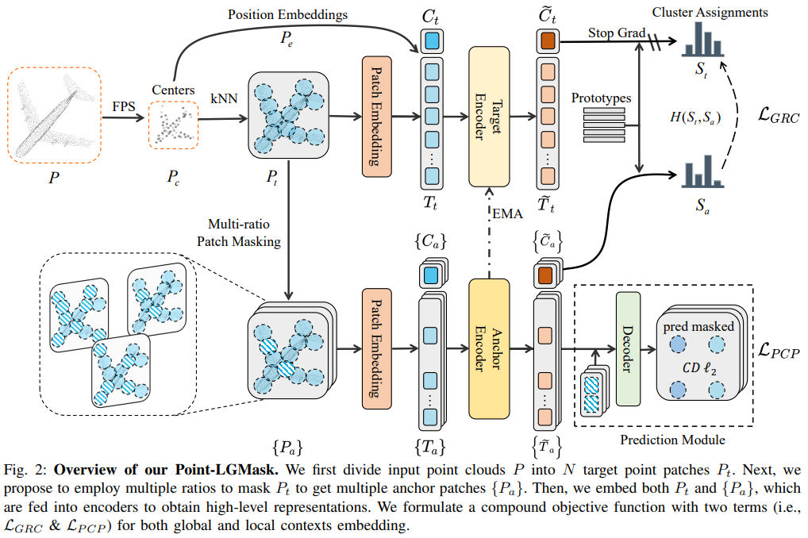
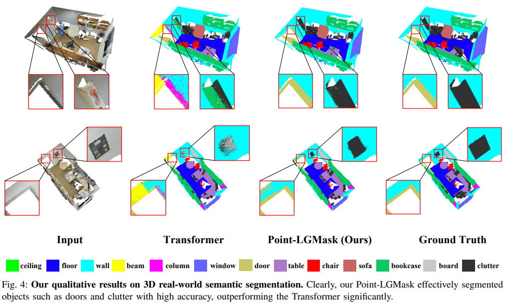

# Point-LGMask: Local and Global Contexts Embedding for Point Cloud Pre-training with Multi-Ratio Masking
This repository contains PyTorch implementation for **Point-LGMask: Local and Global Contexts Embedding for Point Cloud Pre-training with Multi-Ratio Masking**. (TMM 2023)

Point-LGMask, a novel method to embed both local and global contexts with multi-ratio masking, which is quite effective for self-supervised feature learning of point clouds but  is unfortunately ignored by existing pre-training works. Specifically, to avoid fitting to a fixed masking ratio, we first propose multi-ratio masking, which prompts the encoder to fully explore representative features thanks to tasks of different difficulties. Next, to encourage the embedding of both local and global features, we formulate a compound loss, which consists of (i) a global representation contrastive loss to encourage the cluster assignments of the masked point clouds to be consistent to that of the completed input, and (ii) a local point cloud prediction loss to encourage accurate prediction of masked points. Equipped with our Point-LGMask, we show that our learned representations transfer well to various downstream tasks, including few-shot classification, shape classification, object part segmentation, as well as real-world scene-based 3D object detection and  3D semantic segmentation. 


 
## Pretrained Models

### Model for pre-training 

|model| dataset | config | 
| :---: | :---: | :---: |  
 |Point-LGMask| ShapeNet |  [config](./cfgs/pretrain/Point-LGMask.yaml)|

### Model for classification on ModelNet40 

| dataset  | Acc. | Acc. (vote) | config |
| :---: | :---: |:---: |    :---: | 
| ModelNet | 92.9 | 93.8 |  [config](./cfgs/ModelNet_models/PointTransformer.yaml) |

### Model for classification on ScanObjectNN 

|task| dataset  | Acc. | config | 
| :---:| :---: | :---: |  :---: | 
| OBJ-BG| ScanObjectNN |89.84| [config](./cfgs/ScanObjectNN_models/PointTransformer_objectbg_2k.yaml)| 
| OBJ-ONLY| ScanObjectNN |89.33|  [config](./cfgs/ScanObjectNN_models/PointTransformer_objectonly_2k.yaml) | 
| PB-T50-RS| ScanObjectNN |85.25|  [config](./cfgs/ScanObjectNN_models/PointTransformer_hardest_2k.yaml) | 

### Few-shot Learning 

|dataset  |  config | 
|  :---: |  :---: | 
| ModelNet40 | [config](./cfgs/Fewshot_models/PointTransformer_Modelnet40_FS.yaml)| 
| ScanObjectNN | [config](./cfgs/Fewshot_models/PointTransformer_ScanObjectNN_FS_like_crossPoint.yaml)| 

Few-shot Learning on ScanObjectNN

| -| 1-shot (%)|3-shot (%)| 5-shot (%)|  10-shot (%)| 
| :---:| :---: | :---: |  :---: | :---: |
| 5-way |  51.3 ± 9.0 | 66.8 ± 7.5 | 79.6 ± 3.9 | 86.0 ± 6.5 |
| 10-way |  40.9 ± 6.0 |  53.9 ± 6.0 | 65.0 ± 3.5|  73.9 ± 4.0|
| 15-way |   29.6 ± 3.1 | 48.9 ± 3.1 | 58.5 ± 2.9 | 70.4 ± 2.2 |

Few-shot Learning on ModelNet40

| 5-way 10-shot (%) |5-way 20-shot (%)| 10-way 10-shot (%) |10-way 20-shot (%)|
| :---: | :---: |  :---: | :---: |
|  97.4 ± 2.0 | 98.1 ± 1.4 | 92.6 ± 4.3 | 95.1 ± 3.4| 


 

### Semantic Segmentation on    S3DIS 

| dataset  |data| mAcc | mIoU |
| :---: | :---: | :---: |  :---: | 
| S3DIS |only xyz|  70.3|  61.3 |  

### Download  Model Weight

[Google Drive](https://drive.google.com/drive/folders/1N6E1AD6kPFxFMiEBwGGe2YdIj2kz9XZK?usp=sharing)

[Baidu Cloud Pan](https://pan.baidu.com/s/1W3QkaXVPDQL2xT_Bk4WQ_g) (w9db)

## Usage

### Requirements

- Ubuntu 18.04
- CUDA 11.1
- GCC 7.5.0
- Python 3.8
- PyTorch 1.8.0
 

```shell
conda create -n point_lgmask python=3.8 
source activate point_lgmask

conda install pytorch==1.8.0 torchvision==0.9.0 torchaudio==0.8.0 cudatoolkit=11.1 -c pytorch -c conda-forge

pip install -r requirements.txt

# Chamfer Distance
cd ./extensions/chamfer_dist && python setup.py install --user


cd ./extensions/pointnet2
python setup.py install

cd ./extensions/pointops
python setup.py install

pip install "git+https://github.com/erikwijmans/Pointnet2_PyTorch.git#egg=pointnet2_ops&subdirectory=pointnet2_ops_lib"

pip install --upgrade https://github.com/unlimblue/KNN_CUDA/releases/download/0.2/KNN_CUDA-0.2-py3-none-any.whl
```

### Dataset
 
The  used datasets can be found in [DATASET.md](./DATASET.md).


### Point-LGMask pre-training
To pre-train the Point-LGMask models on ShapeNet, simply run:
```shell
CUDA_VISIBLE_DEVICES=0 python main.py \
 --config ./cfgs/pretrain/Point-LGMask.yaml \
 --exp_name exp_name  
```
 
### Fine-tuning on downstream tasks
 
#### Fine-tuning on ModelNet40
To finetune a pre-trained Point-LGMask model on ModelNet40, simply run:
```shell
CUDA_VISIBLE_DEVICES=0 python main.py   \
--finetune_model \
--config ./cfgs/ModelNet_models/PointTransformer.yaml \
--ckpts ./weight_save/pretrain_weight/Point-LGMask_pretrain.pth  \
--exp_name exp_name 
```

To evaluate a model finetuned on ModelNet40, simply run:

```shell
CUDA_VISIBLE_DEVICES=0 python main.py \
--test  \
--config ./cfgs/ModelNet_models/PointTransformer.yaml  \
--ckpts  ./weight_save/MN40/MN40_voting_93_8.pth  \
--exp_name exp_name 
```

#### Few-shot Learning on ModelNet40
We follow the few-shot setting in the previous work.

First, generate your own few-shot learning split or use the same split as us (see [DATASET.md](./DATASET.md)).

 
Then, Train and evaluate the Point-LGMask

```shell 
CUDA_VISIBLE_DEVICES=0 python main.py \
--config cfgs/Fewshot_models/PointTransformer_Modelnet40_FS.yaml  \
--exp_name exp_name  \
--few_shot \
--way 5  \
--shot 10  \
--fold  0  \
--ckpts  ./weight_save/pretrain_weight/Point-LGMask_pretrain.pth
```

#### Few-shot Learning on ScanObjectNN
Train and evaluate the Point_LGMask, simply run:
 
```shell 
CUDA_VISIBLE_DEVICES=0 python main.py \
--config cfgs/Fewshot_models/PointTransformer_ScanObjectNN_FS_like_crossPoint.yaml  \
--exp_name exp_name  \
--few_shot \
--way 5  \
--shot 10  \
--fold  0  \
--ckpts  ./weight_save/pretrain_weight/Point-LGMask_pretrain.pth
```
 


#### Finetune ScanObjectNN
To finetune a pre-trained Point-LGMask model on ScanObjectNN, simply run:

FineTune on PB
```shell
CUDA_VISIBLE_DEVICES=0 python main.py   \
--finetune_model \
--config ./cfgs/ScanObjectNN_models/PointTransformer_hardest_2k.yaml \
--ckpts ./weight_save/pretrain_weight/Point-LGMask_pretrain.pth  \
--exp_name exp_name 
```
FineTune on OB
```shell
CUDA_VISIBLE_DEVICES=0 python main.py   \
--finetune_model \
--config ./cfgs/ScanObjectNN_models/PointTransformer_objectbg_2k.yaml  \
--ckpts  ./weight_save/pretrain_weight/Point-LGMask_pretrain.pth  \
--exp_name exp_name 
```
FineTune on OO
```shell
CUDA_VISIBLE_DEVICES=0 python main.py   \
--finetune_model \
--config ./cfgs/ScanObjectNN_models/PointTransformer_objectonly_2k.yaml  \
--ckpts  ./weight_save/pretrain_weight/Point-LGMask_pretrain.pth  \
--exp_name exp_name 
```
 

##### Test on ScanObjectNN
Test on PB

```shell 
CUDA_VISIBLE_DEVICES=0 python main.py \
--test  \
--config ./cfgs/ScanObjectNN_models/PointTransformer_hardest_2k.yaml  \
--ckpts  ./weight_save/ScanObjecctNN/PB/PB_85_3.pth  \
--exp_name exp_name 
```

Test on OB

```shell 
CUDA_VISIBLE_DEVICES=0 python main.py \
--test  \
--config  ./cfgs/ScanObjectNN_models/PointTransformer_objectbg_2k.yaml  \
--ckpts  ./weight_save/ScanObjecctNN/OB/OB_89_8.pth  \
--exp_name exp_name 
```

Test on OO

```shell
CUDA_VISIBLE_DEVICES=0 python main.py \
--test  \
--config ./cfgs/ScanObjectNN_models/PointTransformer_objectonly_2k.yaml  \
--ckpts  ./weight_save/ScanObjecctNN/OO/OO_89_3.pth  \
--exp_name exp_name 
```

 

#### Semantic segmentation  on S3DIS 
To finetune a pre-trained Point-LGMask model, simply run:
```shell

cd semantic_segmentation

CUDA_VISIBLE_DEVICES=0 python main.py \
        --optimizer_part "all"\
        --ckpts  ../weight_save/pretrain_weight/Point-LGMask_pretrain.pth \
        --root ../data/S3DIS/stanford_indoor3d/ \
        --learning_rate 0.0002 \
        --epoch 60 \
        --log_dir "test_trash"
```

To evaluate, simply run:

```shell
cd semantic_segmentation

CUDA_VISIBLE_DEVICES=1 python main_test.py \
--ckpts ./weight_save/S3DIS/S3DIS_xyz_70_3__61_3.pth    
```

### Visualization
 
**Show Semantic segmentation  on S3DIS**


```shell
cd semantic_segmentation
CUDA_VISIBLE_DEVICES=1 python main_vis.py \
--vis_dir ./vis/test \
--ckpts /home/pc_msn_61/pc_msn/semantic_segmentation/log/semantic_seg/exp_4/checkpoints/best_model_0.6128922261231797.pth 
```
Then, the  npy files of point_LGMask_pre_label, gt_label, and pc_RGB are in ```./semantic_segmentation/vis/test/npy```.

Last, you can follow the [blog](https://blog.csdn.net/weixin_44003119/article/details/129826726?spm=1001.2014.3001.5502) to show npy.

## License
MIT License

## Acknowledgements
Many thanks to the following codes that help us a lot in building this codebase:
* [Point-BERT](https://github.com/lulutang0608/Point-BERT)
* [Point-MAE](https://github.com/Pang-Yatian/Point-MAE)
* [MaskPoint](https://github.com/haotian-liu/MaskPoint)
* [Pointnet2_PyTorch](https://github.com/erikwijmans/Pointnet2_PyTorch)
* [ACT](https://github.com/RunpeiDong/ACT)

## Citation
If you find our work useful in your research, please consider citing: 
```
@article{tang2023point,
  title={Point-LGMask: Local and Global Contexts Embedding for Point Cloud Pre-training with Multi-Ratio Masking},
  author={Tang, Yuan and Li, Xianzhi and Xu, Jinfeng and Yu, Qiao and Hu, Long and Hao, Yixue and Chen, Min},
  journal={IEEE Transactions on Multimedia},
  year={2023},
  publisher={IEEE}
}
```
